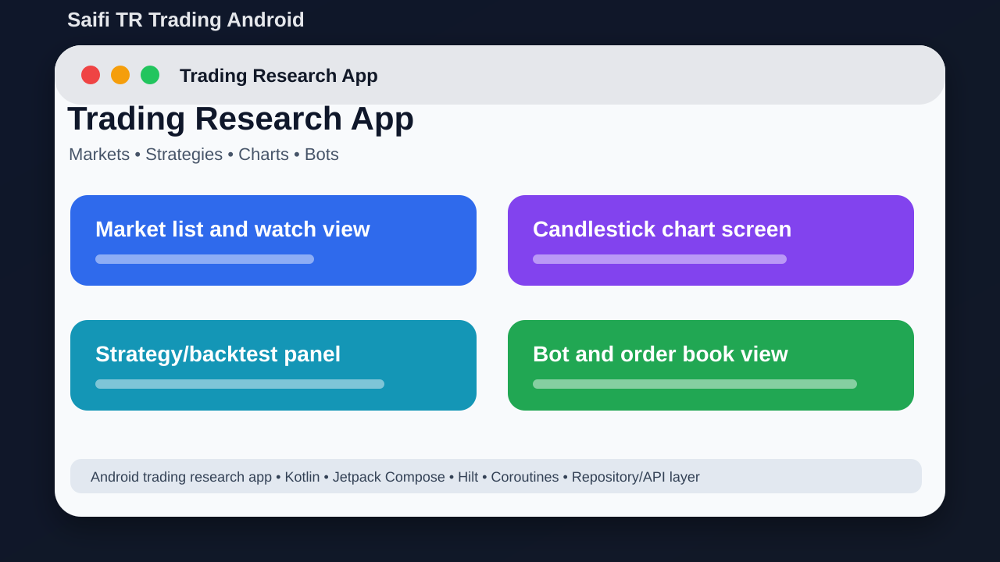

# Saifi TR Trading Android



## Short Description

An Android trading research app for crypto, forex, stocks, strategies, and charts.

## About This Project

Saifi TR Trading Android is a Kotlin Android trading research app. It explores trading screens, market data, strategy ideas, backtesting, bot management, charts, order book views, and exchange repository code.

The goal is to keep the project easy to understand, easy to run, and useful for learning or further development.

## Main Features

- Crypto, forex, and stock trading screens
- Manual trading mode and bot management views
- Backtesting screens and logic
- Trading calculators and strategy classes
- Candlestick and interactive chart components
- Order book views
- Repository/API structure for many exchanges

## Tech Stack

- Kotlin
- Jetpack Compose
- Hilt
- Coroutines
- Repository/API layer

## Project Location

Main local folder:

```text
D:\PROJECTS\SaifiTRTradingAndroid
```

GitHub repository:

https://github.com/saifalian/SaifiTRTradingAndroid

## Project Structure

```text
app/src/main/          Android app source
app/src/main/java/     Kotlin package code
gradle/                Gradle wrapper files
gradlew.bat            Windows Gradle launcher
```

## How To Run

1. Open the project in Android Studio.
2. Sync Gradle.
3. Build with .\gradlew.bat assembleDebug.
4. Run on an emulator or Android device.
5. Review all exchange and risk logic before real use.

## Screenshot

The image above is a clean project preview for GitHub. It shows the main idea of the project in a simple way.

## Build Check

Build note: gradlew.bat exists, but the Gradle wrapper JAR is missing in the local copy. Open the project in Android Studio to resync/regenerate the wrapper, or add the missing wrapper JAR before using gradlew.bat.

## Current Status

This project is uploaded to GitHub and prepared as a portfolio-style repository. More improvements can be added later, such as real app screenshots, demo videos, releases, and issue templates.

## Safety Note

This project is for research and development only. Trading has risk and this is not financial advice.

## License

No license file is included yet. Add a license before using this project as an open-source project.
